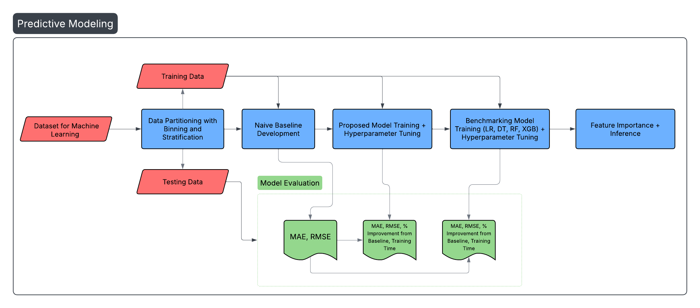

# Wildfire Duration Prediction in Indonesia using Spatio-Temporal Clustering and Ensemble Machine Learning

## Introduction
Proactive efforts for fire suppression can help alleviate the challenges faced by wildfires in Indonesia if wildfire severity can be assessed. This project proposes a comprehensive framework that utilizes remote sensing geospatial datasets to gather key fire drivers and predict wildfire duration in days using a state-of-the-art ensemble machine learning model paired with spatio-temporal clustering. Fire hotspot data from NASA’s Fire Information for Resource Management System (FIRMS) is processed using the DBSCAN algorithm to group proximate hotspots across space and time into discrete fire events to construct an event-level duration target. A set of meteorological, topographic, vegetation, and anthropogenic variables is derived from multi-source geospatial datasets with the help of Google Earth Engine to enrich the fire events. Then a Histogram Gradient Boosting Regressor is trained and evaluated for duration prediction and optimized for achieving maximum performance. The proposed model is evaluated against a naïve baseline and benchmarked against linear and tree-based models. Results are explained by mean absolute errors (MAE), root mean squared errors (RMSE), % improvement from naïve baseline and training time, while highlighting each feature’s contributions to wildfire duration prediction.

  

  

## Repository Structure

### Data
This folder contains the following:
1) Raw historical fire hotspots data extracted from the FIRMS database saved as zipped csv files. These datasets are referred to as M-C61, SV-C2, J1V-C2 and J2V-C2. M-C61 dataset comprises fire occurrences recorded by the MODIS instrument aboard the Aqua and Terra satellites, with a total of 1,538,815 rows. SV-C2 dataset contains fire records gathered by the VIIRS instrument aboard the Suomi National Polar-orbiting Partnership (S-NPP) satellite, consisting of 3,425,056 rows. J1V-C2 and J2V-C2 datasets also contain fire hotspots recorded by the VIIRS radiometer but equipped by the National Oceanic and Atmospheric Administration – 20 (NOAA-20), each having 1,220,010 and 121,144 rows. The data from the S-NPP satellite is uploaded in year-wise batches in parquet format to comply with Git file limits.
2) Processed fire events which are a result of spatio-temporal clustering saved as `fire_events.csv`.
3) Feature extractions saved as csv files which are products of Google Earth Engine and feature extraction python scripts.
4) The final consolidated dataset with fire events merged with all feature extractions saved as `Fire Events - Feature Enriched.csv`.
   
### Scripts
This folder contains the following:
1) The main python notebook `Data Science Research Project.ipynb` that performs all the key stages of the project - from data collection and processing to developing the predictive model and analyzing results.
2) Javascripts from Google Earth Engine to extract the meteorological, topographic and vegetation features saved as .js files.
3) Python scripts for extracting anthropogenic features from OpenStreetMap.
