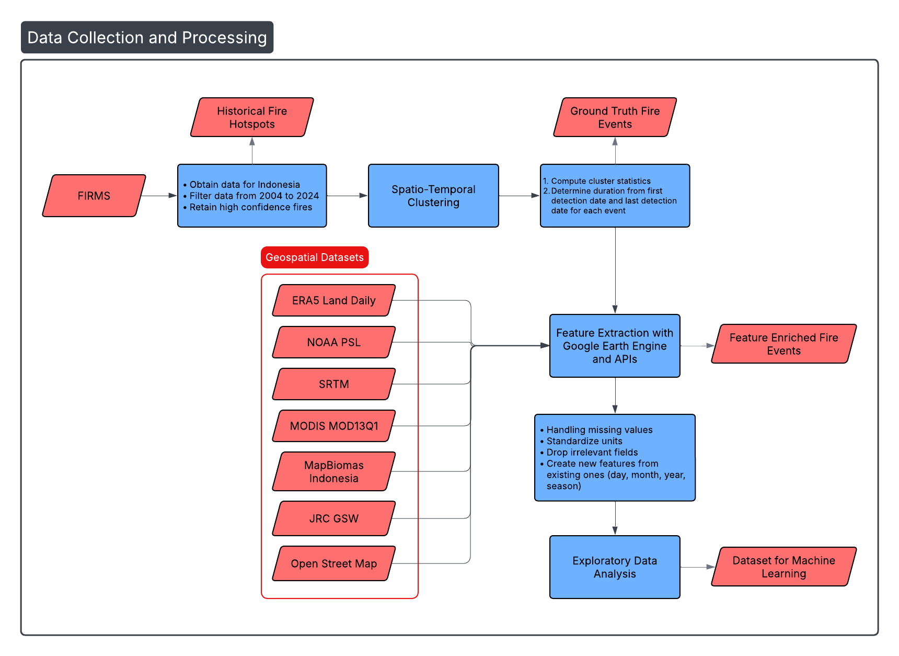

# Wildfire Duration Prediction in Indonesia using Spatio-Temporal Clustering and Ensemble Machine Learning

## Introduction
Proactive efforts for fire suppression can help alleviate the challenges faced by wildfires in Indonesia if wildfire severity can be assessed. This project proposes a comprehensive framework that utilizes remote sensing geospatial datasets to gather key fire drivers and predict wildfire duration in days using a state-of-the-art ensemble machine learning model paired with spatio-temporal clustering. Fire hotspot data from NASA’s Fire Information for Resource Management System (FIRMS) is processed using the DBSCAN algorithm to group proximate hotspots across space and time into discrete fire events to construct an event-level duration target. A set of meteorological, topographic, vegetation, and anthropogenic variables is derived from multi-source geospatial datasets with the help of Google Earth Engine to enrich the fire events. Then a Histogram Gradient Boosting Regressor is trained and evaluated for duration prediction and optimized for achieving maximum performance. The proposed model is evaluated against a naïve baseline and benchmarked against linear and tree-based models. Results are explained by mean absolute errors (MAE), root mean squared errors (RMSE), % improvement from naïve baseline and training time, while highlighting each feature’s contributions to wildfire duration prediction.

  

